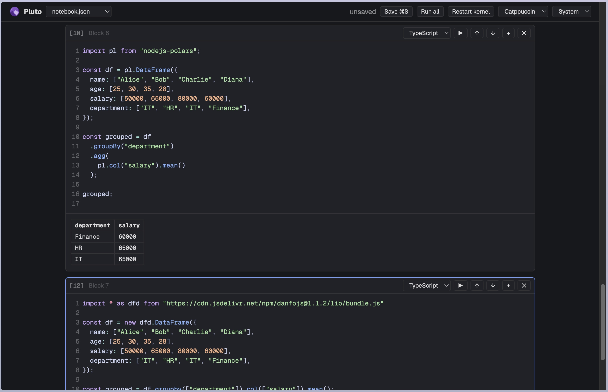

<p align="center"></p>

# Pluto

A notebook in a single binary: TypeScript/JavaScript, Postgres, SQLite, DuckDB and Polars cells, a Vue UI with a
CodeMirror editor (TypeScript completions), and an MCP endpoint for agents.



## Install

Pick the file for your machine from the [latest release](https://github.com/Junkiez/pluto/releases/latest):

| Platform | File |
|---|---|
| macOS, Apple Silicon (M1+) | `pluto-darwin-arm64.tar.gz` |
| macOS, Intel | `pluto-darwin-x64.tar.gz` |
| Linux x64 | `pluto-linux-x64.tar.gz` |
| Linux ARM64 | `pluto-linux-arm64.tar.gz` |
| Windows x64 | `pluto-win32-x64.zip` |

**macOS / Linux** — download, unpack and put it on your `PATH` (swap in your platform's file name):

```bash
curl -L https://github.com/Junkiez/pluto/releases/latest/download/pluto-darwin-arm64.tar.gz | tar -xz
sudo mv pluto /usr/local/bin/
```

> **macOS: "cannot be opened because the developer cannot be verified"** — the binary isn't signed by Apple, and
> files downloaded through a browser get quarantined. `curl` (above) avoids it; otherwise clear the flag once:
> `xattr -d com.apple.quarantine /usr/local/bin/pluto`

**Windows** — unzip `pluto-win32-x64.zip` and run `pluto.exe` from a terminal. SmartScreen may warn about an
unrecognized app: *More info → Run anyway*.

**Docker** — multi-arch image (amd64/arm64) on GitHub Packages:

```bash
docker run -p 9999:9999 -v pluto-data:/data -e PLUTO_PASS=secret ghcr.io/junkiez/pluto
```

Notebooks and their databases live in the `/data` volume (a fresh volume starts with the sample notebooks).
Always set `PLUTO_PASS` when the port is reachable by others — cells run arbitrary code.

On first use of DuckDB or Polars, Pluto unpacks their engines (~210 MB) into `~/.cache/pluto`.

## Run

```bash
pluto --file notebook.json
```

Open http://localhost:9999. Sample notebooks are in [`example/`](example).

| Flag | |
|---|---|
| `--file <path>` | notebook to open (default `notebook.json`); notebooks next to it show up in the picker |
| `--pass <password>` | require a password (browser prompt, `?password=` link, or `Authorization: Bearer` for MCP). `PLUTO_PASS` env works too |
| `--unsafe` | give cells the real filesystem; without it, `fs`, DuckDB and SQLite are confined to `<notebook>.files/` |
| `--allow-import=host,…` | hosts JS cells may import from (default esm.sh, cdn.jsdelivr.net, unpkg.com, jsr.io); bare `--allow-import` allows any |
| `PORT` env | port (default 9999) |

Per notebook, data lives next to the file: `<name>.pgdata` (Postgres), `<name>.sqlite`, `<name>.duckdb`, `<name>.files/`.

## Cells

- **TypeScript / JavaScript** — one shared kernel (edge-runtime). Top-level `await`, URL/esm.sh imports, HTML output.
  Globals: `sql` (Postgres), `duck` (DuckDB), `pl` (Polars), `fs`.
- **Postgres** (PGlite), **SQLite** (bun:sqlite), **DuckDB** — results render as tables.
- **Polars** — SQL over the DataFrames defined in JS cells, by variable name.

## MCP

`http://localhost:9999/mcp` (Streamable HTTP). Tools: `run_code`, `get_notebook`, `add_cell`, `update_cell`,
`delete_cell`, `list_notebooks`, `open_notebook`.

```bash
claude mcp add --transport http pluto http://localhost:9999/mcp --header "Authorization: Bearer <password>"
```

## Build

```bash
npm ci
npm run build   # -> example/pluto
```

Builds for the platform you're on (DuckDB and Polars are native). CI builds darwin-arm64, darwin-x64, linux-x64 and
linux-arm64 and publishes a release on every push to `main` (`.github/workflows/release.yml`).

```
src/server.ts          server, kernels, MCP
src/web/               UI: index.html (Vue), editor.ts (CodeMirror + Shiki), ts-worker.ts (TypeScript service)
src/native/            loaders for the embedded DuckDB / Polars native libraries
scripts/               build steps: gen-types (TS libs for the editor), gen-native (per-platform native paths)
example/               sample notebooks (+ the built binary)
```
